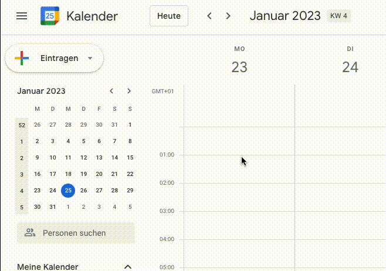
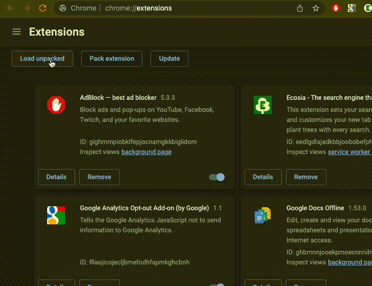

# Red Pointer Extension

A simple chrome extension to show a big fat red pointer.

Shortcut: `Ctrl+<` (Control and Backquote)

**Benefits**
- Use it in presentations so your attendees can easily follow your presentation
- Use it to find your cursor on big screens

## Example

## Install chrome extension

In chrome-More tools-Extension view you can load the folder of this repository.

